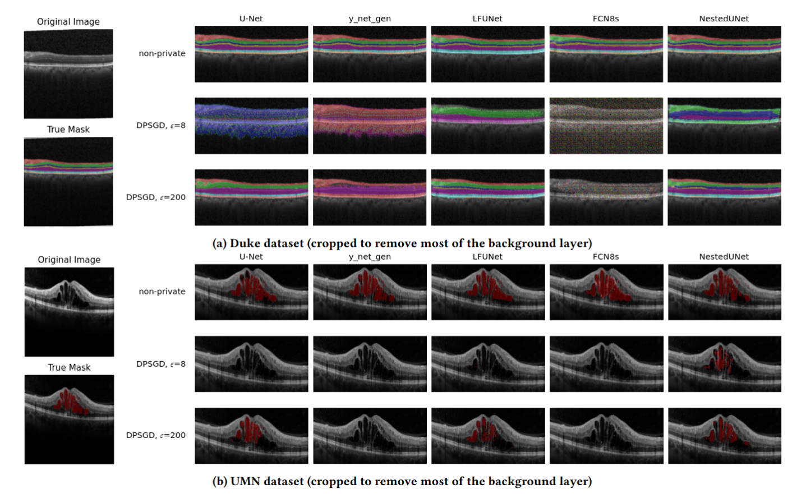
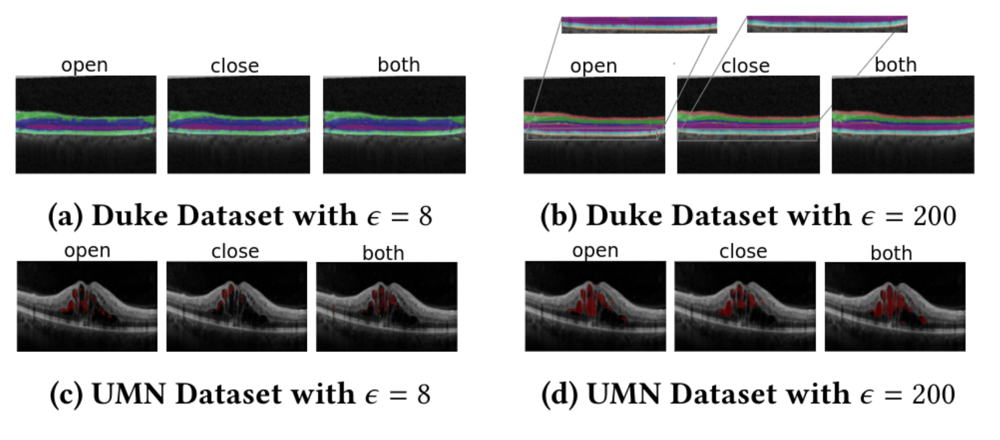

# DP-Morph

This repository contains the implementation of the code for the paper "**DP-Morph: Improving the Privacy-Utility-Performance Trade-off for Differentially Private OCT Segmentation**".
Our paper has been accepted at **ACM CCS 2025**, presented in the **18th ACM Workshop on Artificial Intelligence and Security (AISec)**.


# About

Medical imaging models, particularly for **Optical Coherence Tomography (OCT)**, play a crucial role in diagnosing retinal diseases. However, using sensitive medical data for training introduces **privacy concerns**, as attackers can infer whether a specific patient’s data was used.

This project explores the trade-offs between **privacy**, **segmentation accuracy**, and **computational efficiency** when applying **Differentially Private Stochastic Gradient Descent (DPSGD)** to OCT segmentation models. We benchmark five state-of-the-art segmentation models:

- **U-Net**
- **LFUNet**
- **Y-Net-Gen**
- **FCN8s**
- **NestedUNet**

Here you can see the Performance of different models on Duke (top) and UMN (bottom) datasets. The top row shows non-private perfor-
mance, the two bottom rows show results with DPSGD training for ε = 8 and ε = 200. Comparison with the true mask (lower
left) shows that most models provide unsatisfactory segmentation performance with high privacy protection (ε = 8)




under different privacy budgets (ε) and measure:

- **Utility** – Segmentation accuracy (*Dice coefficient*, *MAE*, *Loss*)
- **Privacy** – Theoretical (ε, δ) guarantees & empirical *Membership Inference Attacks*
- **Performance** – *GPU memory*, *runtime*, *energy consumption*

To mitigate the accuracy loss caused by DPSGD, we propose **DP-Morph**—a novel method that integrates **differentiable morphological operations** (like *dilation* and *erosion*) into the training pipeline, improving segmentation quality without weakening privacy guarantees.
The following image shows the Segmentation performance of DP-Morph with NestedUNet for different morphological operators:



# Datasets

We use the Duke and UMN datasets, which are also included in this repository.

# OCT_Segmentation

This directory includes all codes that are necessary for generating morph and non-morph results for both DPSGD and non-DPSGD cases.
## Requirements
First, the following packages should be installed:

```bash
pip install torch tqdm numpy matplotlib opacus kornia torchinfo

``` 
If you plan to use fastDP library, install:

```bash
pip install fast-dp

```
## Training
For running the code, you can:

```bash
python train-one-gpu.py --dataset UMN --n_classes 2 --batch_size 16 --num_iterations 200 --learning_rate 0.0005 --model_name NestedUNet --morphology True --operation "close" 

```
For non-morph cases, set morphology to False and there is no need to define the operation.
To run the code in a privacy-preserving manner (using DPSGD), you should:

```bash
python train-one-gpu.py --dataset UMN --n_classes 2 --batch_size 16 --num_iterations 200 --learning_rate 0.0005 --model_name NestedUNet --morphology True --operation "close" --DPSGD True cuda 

```

For running the fastDP mode ,just replace train_one_gpu.py with train-one-gpu_fast.py.


The arguments are:

| Argument               | Type    | Default          | Description                                                                                      |
|------------------------|---------|------------------|--------------------------------------------------------------------------------------------------|
| `--dataset`            | string  | `Duke`            | Dataset to use. Options: `Duke`, `UMN`                                                          |
| `--batch_size`         | int     | 16               | Number of samples per batch                                                                      |
| `--num_iterations`     | int     | 200              | Number of training iterations                                                                    |
| `--learning_rate`      | float   | 0.0005           | Learning rate for the optimizer                                                                  |
| `--n_classes`          | int     | 9                | Number of output classes                                                                          |
| `--ffc_lambda`         | float   | 0                | Lambda parameter for FFC (if used)                                                               |
| `--weight_decay`       | float   | 1e-9             | Weight decay (L2 regularization)                                                                 |
| `--image_size`         | int     | 224              | Size of the input images                                                                          |
| `--model_name`         | string  | `NestedUNet`     | Model architecture to use. Options: `unet`, `y_net_gen`, `y_net_gen_ffc`, `UNetOrg`, `LFUNet`, `FCN8s`, `NestedUNet`, `SimplifiedFCN8s`, `ConvNet` |
| `--g_ratio`            | float   | 0.5              | Custom parameter (add your specific description)                                                 |
| `--device`             | string  | `cuda`           | Device to run the model on. Options: `cuda`, `cpu`                                               |
| `--in_channels`        | int     | 1                | Number of input channels (e.g., 1 for grayscale images)                                          |
| `--image_dir`          | string  | None             | Path to the directory containing input images                                                   |
| `--DPSGD`              | bool    | False            | Enable Differentially Private SGD                                                               |
| `--test`               | bool    | False            | Run in test mode                                                                                  |
| `--model_should_be_saved` | bool  | False            | Save the trained model                                                                            |
| `--model_should_be_load`  | bool  | False            | Load a saved model                                                                               |
| `--save_dir`           | string  | `./saved_models/`| Directory to save or load models                                                                 |
| `--epsilon`            | float   | 8                | Privacy epsilon value for DPSGD                                                                  |
| `--morphology`         | bool    | True             | Enable morphology operations                                                                     |
| `--operation`          | string  | `close`          | Morphology operation type. Options: `close`, `open`, `both`                                     |
| `--kernel_size`        | int     | 3                | Kernel size for morphology operations                                                           |


**Please note: If you set the dataset to Duke, the n_classes parameter should be 9; for UMN, it should be 2**.

The remaining parameters for each dataset and model are detailed in the paper.

# Computational Plots

You can use plot_non_morph_computational.py to generate the computational plots reported in the paper.
The corresponding dataset is provided in the same directory as oct_final_data.xlsx.

For morphology-based results, use the dataset data_computational_morph.csv together with the script plot_morph_computational.py (these plots are not reported in the paper)

# Attack

Please check the Attack directory.


# 📚 Citation

If you use this repository, or if it inspires your work, please cite the following paper:

